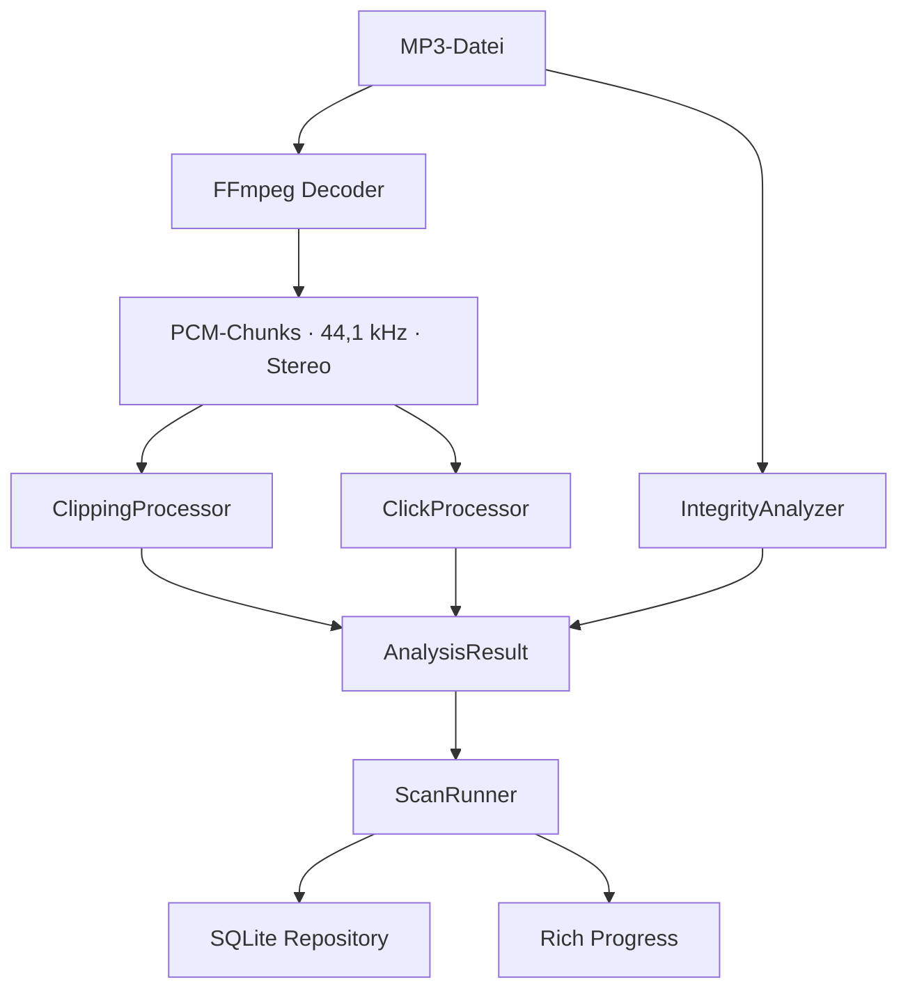

# MP3 Quality Scanner

```mermaid
flowchart TD
    MP3["MP3-Datei"] --> Integrity["IntegrityAnalyzer"]
    MP3 --> Decoder["FFmpeg Decoder"]
    Decoder --> Stream["PCM-Chunks · 44,1 kHz · Stereo"]
    Stream --> Clip["ClippingProcessor"]
    Stream --> Click["ClickProcessor"]
    Clip --> Results["AnalysisResult"]
    Click --> Results
    Integrity --> Results
    Results --> Runner["ScanRunner"]
    Runner --> DB["SQLite Repository"]
    Runner --> UI["Rich Progress"]
```